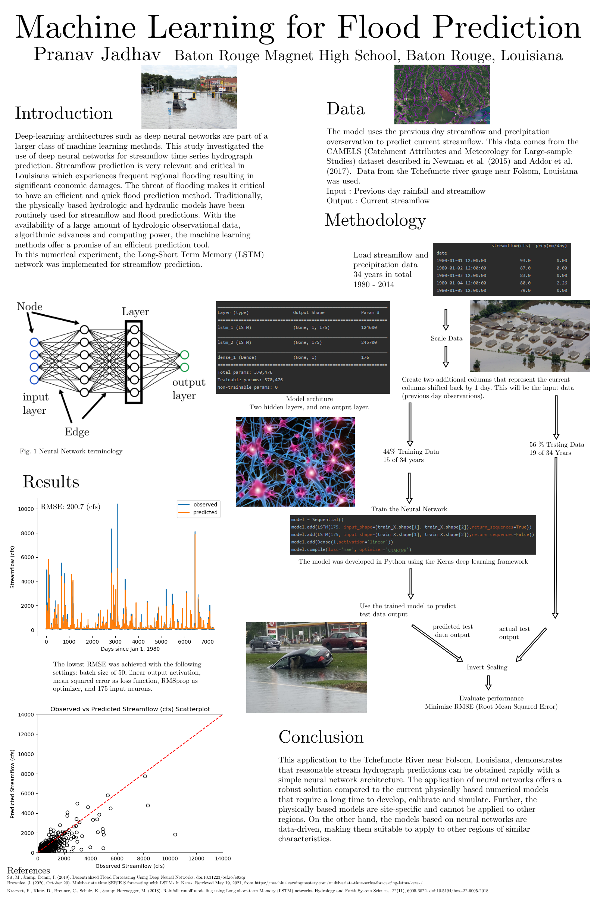

# Flood-Prediction-Project
Flood prediction in southern Louisiana using LSTMs and GRUs

The main code is located in the file : [LSTM_camels03(Best).py](LSTMwithKERASmultivar/LSTM_camels03(Best).py)

This project was a featured poster presented at the Louisiana State of the Coast 2021 Conference:

